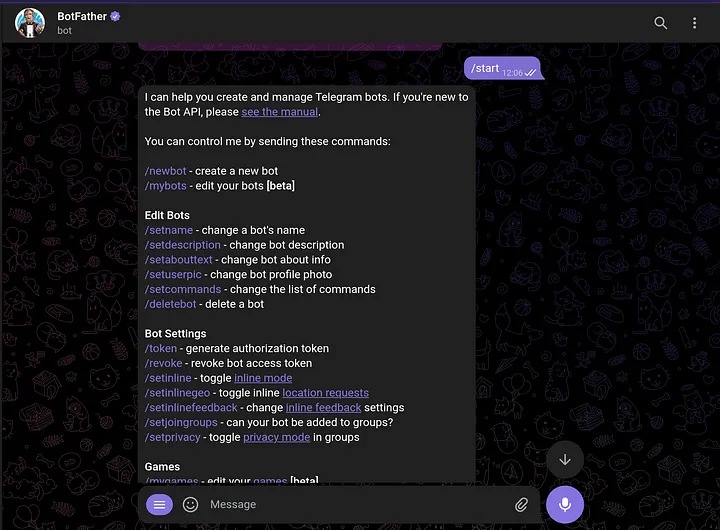
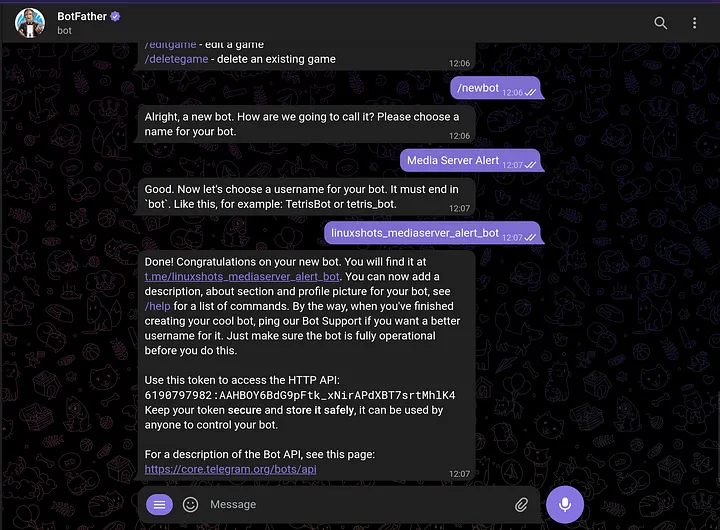
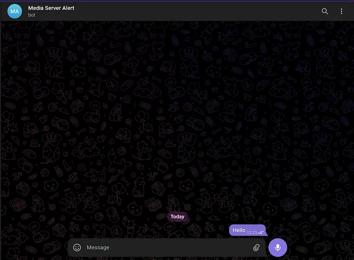
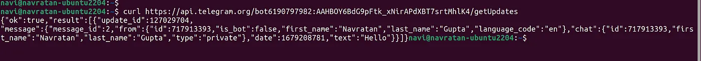

# 📡 Monitoramento de Servidor Nginx com Notificação no Telegram

**Projeto desenvolvido para o Compass UOL**  
Script de monitoramento que verifica a disponibilidade do Nginx a cada minuto e envia alertas via Telegram em caso de falha.

---

### 1. Instalação do Ambiente Linux 🛠

Para este projeto utilizamos:
- **Distribuição**: Ubuntu 24.04 LTS
- **Virtualização**: Oracle VirtualBox 7.0
- **Configuração mínima recomendada**:
  - 2 vCPUs
  - 2GB RAM
  - 20GB de armazenamento (dinâmico)

**Passos de instalação**:
1. Baixe a ISO oficial do Ubuntu 24.04
2. Crie uma nova VM no VirtualBox
3. Execute a instalação padrão
4. Após instalação, atualize os pacotes:
```bash
sudo apt update && sudo apt upgrade -y
```

### 2. Configuração do Servidor Webinx 🖥️

Execute os seguintes comandos para instalar o servidor web:
```
sudo apt-get install nginx -y
```

Verifique se o servidor está executando:
```
service nginx status
```

Caso após a instalação o servidor não tenha iniciado utilize: 
```
service nginx start
```

Sinta-se a vontade para trocar a página que será exibida pelo nginx, basta excluir o arquivo padrão .html do nginx e por outro no lugar, o diretório para trocar é o seguinte:

```
cd /var/www/html
```
### 3. Script de Monitoramento 

Baixe o arquivo nginx_monitor.sh 

Em seguinte de todas as permissões ao arquivo
```
chmod 777 nginx_monitor.sh
```

### Por conseguinte é necessário a criação do bot do telegram:

Primeiro crie sua conta no telegram e depois procure por BotFather e o inicie 


Após iniciar o BotFather envie /start para começar 



Ao começar a conversa envie /newbot, em seguida envie o nome que quer dar ao bot e depois o username

Depois que concluir esse passo ele dará um link para você inicar a conversa com o seu bot e o API TOKEN para se comunicar com o bot, guarde esse token com cuidado !!





Copie o token que lhe foi dado e em seguida envie o seguinte código no bash trocando apenas <SUA_API_TOKEN_AQUI> pelo seu token gerado

```
curl https://api.telegram.org/bot<SUA_API_TOKEN_AQUI>/getUpdates
```

No resultado da requisição você irá receber muitas informações, mas guarde o principal que é o CHAT ID



Com o token e o CHAT ID guardados podemos voltar ao script

Créditos ao tutorial de criação de bot: https://medium.com/linux-shots/setup-telegram-bot-to-get-alert-notifications-90be7da4444

### Explicando o script
```
#!/bin/bash # Escolhemos o bash no qual será executado o script

DATA=$(date +%d/%m/%Y) # armazena em uma variável a data atual
HORA=$(date +%H:%M:%S) # armazena em uma variável a hora atual
BOT_TOKEN= # armazena em uma variável o API TOKEN do bot
CHAT_ID= # armazena em uma variável o Chat Id do bot
STATE_FILE="/tmp/server_status.state" # armazena em um arquivo o status final do servidor como available = true e unavailable = false

if [ ! -f "$STATE_FILE" ]; then   # verificação se o arquivo STATE_FILE existe, caso não exista ele é criado e recebe o valor false
    echo "false" > "$STATE_FILE"    
fi

function verify_nginx_available(){ # função que retorna se o nginx está available no sistema
	systemctl is-active --quiet nginx
	return $?
}

function verify_website(){ # função que verifica se o website gerenciado pelo nginx está recebendo requisição e retornando 200 para ver se está disponível
	statusCode=$(curl -o /dev/null -s -w "%{http_code}\n" http://localhost/)

	if [ "$statusCode" != "200" ]; then
		return 1  
	else
		return 0 
	fi
}

function send_message_to_telegram(){ # função que recebe uma mensagem de parâmetro e envia para o bot do telegram
	local message="$1"
	curl -s -o /dev/null -X POST "https://api.telegram.org/bot$BOT_TOKEN/sendMessage" \
		-H 'Content-Type: application/json' \
		-d "{\"chat_id\":\"$CHAT_ID\", \"text\":\"$message\"}"
}


while true; do # inicia um loop infinito para o script
    

    AVAILABLE=$(cat "$STATE_FILE") # inicia uma variavel available com o valor do state_file

    if verify_nginx_available && verify_website; then # usa as duas funções para verificar a disponibilidade do servidor e do website
        if [ "$AVAILABLE" == "false" ]; then # caso o servidor e o website estiverem OK e o available estiver em false, é mandado uma mensagem ao telegram dizendo que o servidor voltou a funcionar
            send_message_to_telegram "✅ O servidor está de volta! A página web está funcionando normalmente e disponível para acesso."
            echo "true" > "$STATE_FILE"
        fi
        echo "$DATA $HORA ** Serviço Nginx rodando e página web no ar!" >> /var/log/meu_script.log # Sempre que o servidor e o website estiver disponível é escrito no log a data e hora da verificação apontando que o servidor se encontra dispónivel
    else
        if [ "$AVAILABLE" == "true" ]; then # caso o servidor e o website não estiverem OK e o available estiver em true, é mandado uma mensagem ao telegram dizendo que o servidor parou de funcionar
            send_message_to_telegram "⚠️ Atenção: O servidor está enfrentando problemas e a página web não está disponível no momento. Estamos trabalhando para resolver o mais rápido possível."
            echo "false" > "$STATE_FILE"
        fi
        echo "$DATA $HORA ** Serviço Nginx não está rodando, página web fora do ar!" >> /var/log/meu_script.log # Sempre que o servidor e o website não estiver disponível é escrito no log a data e hora da verificação apontando que o servidor não se encontra disponível
    fi
    sleep 60 #reiniciar o while após 1 minuto
done
```

Agora é necessário que você coloque o valor do seu BOT TOKEN API na variavel BOT_TOKEN= e o seu Chat id na variável CHAT_ID= 

Pronto seu monitoramento do Nginx está feito !!


